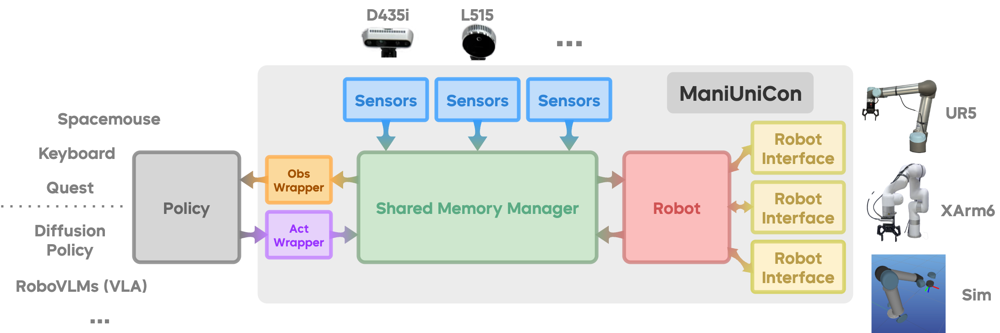
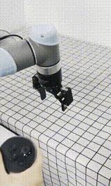
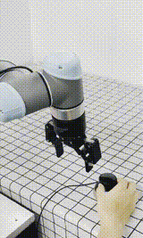
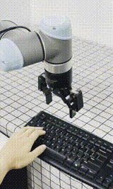
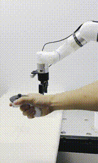
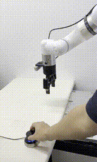
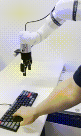

# ManiUniCon: A Unified Control Interface for Robotic Manipulation

ManiUniCon is a comprehensive, multi-process robotics control framework designed for robotic manipulation tasks. It provides a unified interface for controlling various robot arms, integrating sensors, and executing policies in real-time.

## 🚀 Features

- **Modular Design**: Plug-and-play architecture for seamless integration of new robot arms and algorithms
- **Multi-Robot Support**: Compatible with UR5, XArm6, and easily extensible to other robotic arms
- **One-Click Switching**: Effortlessly transition between data collection and policy deployment modes
- **Real-time Control**: High-frequency control loops with shared memory architecture
- **Algorithm Agnostic**: Easy integration of new learning algorithms through standardized interfaces
- **Sensor Integration**: Support for RealSense cameras and other sensor modalities
- **Visualization**: 3D visualization support with Meshcat
- **Flexible Configuration**: Hydra-based configuration management for quick experiment setup
- **Safety Features**: Emergency stop, error handling, and reset functionality

## 🏗️ Architecture

ManiUniCon uses a multi-process architecture with shared memory for efficient real-time communication:



## 🔧 Supported Hardware

### Robot Arms
- **UR5**: Universal Robots UR5 with RTDE interface
  
  <p align="center">
    
    
    
  </p>

- **XArm6**: UFACTORY XArm6 collaborative robot

  <p align="center">
    
    
    
  </p>

### Sensors
- **RealSense Cameras**: Intel RealSense depth cameras

### Teleoperation Devices
- **Meta Quest Controllers**: Meta Quest VR controllers for intuitive 6-DOF manipulation
- **SpaceMouse**: 3Dconnexion SpaceMouse for precise position and orientation control
- **Keyboard**: Basic keyboard control for simple teleoperation tasks

## 📦 Installation

### Prerequisites
- Python 3.10+
- CUDA-capable GPU (optional, for policy inference)
- Robot hardware or simulation environment

### Install from Source

1. **Clone the repository**:
```bash
git clone https://github.com/Universal-Control/ManiUniCon.git
cd ManiUniCon
git submodule update --init --recursive
```

2. **Create a conda environment**:
```bash
conda create -n unicon python=3.10
conda activate unicon
```

3. **Install the package**:
```bash
pip install -e .
pip install -e ./third_party/oculus_reader
```

### Hardware-Specific Installation

For **UR5** robot:
```bash
pip install -e '.[ur5]'
```

For **XArm6** robot:
```bash
pip install -e '.[xarm]'
```

For **RealSense** cameras:
```bash
pip install -e '.[realsense]'
```

## 🎮 Usage

### Basic Usage

1. **Configure your setup** by editing the configuration files in `configs/`:
   - `configs/robot/` - Robot-specific configurations
   - `configs/policy/` - Policy configurations
   - `configs/sensors/` - Sensor configurations

2. **Run the system with default configs**:
```bash
python main.py
```

3. **Control the robot**:
   - Press `h` to reset the robot to home position
   - The system will automatically start all processes (sensors, policy, robot control)

### Demonstration Data Collection

Collect demonstration data for training:

1. **Start data collection with teleoperation**:
```bash
# Using Quest controllers
python main.py robot=ur5 policy=quest policy.record_dir=./data/ur5_recording

# Using keyboard control
python main.py robot=ur5 policy=keyboard policy.record_dir=./data/ur5_recording

# Using SpaceMouse
python main.py robot=ur5 policy=spacemouse policy.record_dir=./data/ur5_recording
```

2. **Process collected data**:
```bash
# Merge multiple episodes into a single zarr file
python tools/process_demo_data.py ./data/ur5_recording
```

### Configuration Examples

#### Teleoperate XArm6 with SpaceMouse Control
```bash
python main.py robot=xarm6 sensors=realsense_xarm policy=spacemouse
```

#### UR5 with RealSense Camera
```bash
python main.py robot=ur5 sensors=realsense_ur policy=ppt_rgb_simple
```

## 🔧 Development

### Project Structure

```
ManiUniCon/
├── maniunicon/              # Main package
│   ├── core/               # Core robot and control logic
│   ├── robot_interface/    # Robot-specific interfaces
│   ├── policies/           # Policy implementations
│   ├── sensors/            # Sensor interfaces
│   ├── customize/          # Custom wrappers and models
│   └── utils/              # Utility functions
├── configs/                # Configuration files
│   ├── robot/              # Robot configurations
│   ├── policy/             # Policy configurations
│   └── sensors/            # Sensor configurations
├── assets/                 # Robot models and assets
├── tools/                  # Utility scripts
└── third_party/            # Third-party packages
```

### Adding New Robots

1. Create a new robot interface in `maniunicon/robot_interface/` that inherits from `RobotInterface` base class:
```python
from maniunicon.robot_interface.base import RobotInterface
from maniunicon.utils.shared_memory.shared_storage import RobotAction, RobotState

class MyRobotInterface(RobotInterface):
    def connect(self) -> bool:
        # Connect to the robot hardware
        pass
    
    def disconnect(self) -> bool:
        # Disconnect from the robot hardware
        pass
    
    def get_state(self) -> RobotState:
        # Get the current state of the robot
        pass
    
    def send_action(self, action: RobotAction) -> bool:
        # Send a control action to the robot
        pass
    
    def reset_to_init(self) -> bool:
        # Reset the robot to the initial configuration
        pass
    
    def forward_kinematics(self, joint_positions: np.ndarray) -> Tuple[np.ndarray, np.ndarray]:
        # Compute forward kinematics (returns position and orientation)
        pass
    
    def inverse_kinematics(self, target_position: np.ndarray, 
                          target_orientation: np.ndarray, 
                          current_q: np.ndarray) -> np.ndarray:
        # Compute inverse kinematics
        pass
    
    def is_connected(self) -> bool:
        # Check if the robot is connected
        pass
    
    def is_error(self) -> bool:
        # Check if the robot is in an error state
        pass
    
    def clear_error(self) -> bool:
        # Clear any error state
        pass
    
    def stop(self) -> bool:
        # Emergency stop the robot
        pass
```

2. Add configuration in `configs/robot/my_robot.yaml`

3. Register the robot in the configuration defaults

### Adding New Policies

For **PyTorch-based policies**, we recommend using the existing `TorchModelPolicy` class:

1. Create custom wrappers in `maniunicon/customize/`:
   - **Observation wrapper** in `obs_wrapper/`: Preprocesses sensor data for your model
   - **Action wrapper** in `act_wrapper/`: Post-processes model outputs into robot actions

```python
# Example: maniunicon/customize/obs_wrapper/my_obs_wrapper.py
class MyObsWrapper:
    def __init__(self, shared_storage, device, **kwargs):
        self.shared_storage = shared_storage
        self.device = device
    
    def __call__(self, state, camera):
        # Process state and camera data into model input
        return obs_tensor

# Example: maniunicon/customize/act_wrapper/my_act_wrapper.py  
class MyActWrapper:
    def __init__(self, **kwargs):
        pass
    
    def __call__(self, model_output, timestamp, start_timestamp, **kwargs):
        # Convert model output to robot actions
        return actions
```

2. Configure your policy in `configs/policy/my_policy.yaml`:
```yaml
_target_: maniunicon.policies.torch_model.TorchModelPolicy
model:
  _target_: path.to.your.model
obs_wrapper:
  _target_: maniunicon.customize.obs_wrapper.my_obs_wrapper.MyObsWrapper
act_wrapper:
  _target_: maniunicon.customize.act_wrapper.my_act_wrapper.MyActWrapper
```

**Note**: Only create a new policy class if `TorchModelPolicy` cannot meet your specific needs (e.g., non-PyTorch models, custom control loops):

```python
# Custom policy class (only if needed)
class MyCustomPolicy(mp.Process):
    def __init__(self, shared_storage, reset_event, **kwargs):
        super().__init__()
        self.shared_storage = shared_storage
        self.reset_event = reset_event
    
    def run(self):
        # Implement custom policy logic
        pass
```

3. Add configuration in `configs/policy/my_policy.yaml`

## 🛠️ Available Tools

The `tools/` directory contains utility scripts for:
- **Camera calibration**: `calibration/` - Tools for camera-robot calibration
- **Data processing**: `process_demo_data.py` - Process demonstration data
- **Recording**: `replay_record_data.py` - Replay and record robot data
- **Visualization**: `save_zarr_video.py` - Save recorded data as video
- **Hardware setup**: `list_realsense_cameras.py` - List available RealSense cameras

## 🤝 Contributing

1. Fork the repository
2. Create a feature branch (`git checkout -b feature/amazing-feature`)
3. Commit your changes (`git commit -m 'Add amazing feature'`)
4. Push to the branch (`git push origin feature/amazing-feature`)
5. Open a Pull Request

## 📚 Resources

For additional information and support:
- [GitHub Issues](https://github.com/Universal-Control/ManiUniCon/issues) - Report bugs or request features
- [Discussions](https://github.com/Universal-Control/ManiUniCon/discussions) - Ask questions and share ideas

## 🔒 Safety

⚠️ **Important Safety Notes**:
- Always ensure proper robot workspace setup
- Test in simulation before running on real hardware
- Keep emergency stop accessible
- Follow robot manufacturer's safety guidelines
- Monitor robot behavior during operation

## 📄 License

This project is licensed under the MIT License - see the [LICENSE](LICENSE) file for details.

## 📖 Citation

If you use ManiUniCon in your research, please cite:

```bibtex
@software{maniunicon2025,
  title={ManiUniCon: A Unified Control Interface for Robotic Manipulation},
  author={Zhengbang Zhu and Minghuan Liu},
  year={2025},
  url={https://github.com/Universal-Control/ManiUniCon}
}
```

## 🙏 Acknowledgments

- [Diffusion Policy](https://github.com/real-stanford/diffusion_policy)

---

For more information or support, please open an issue on [GitHub](https://github.com/Universal-Control/ManiUniCon/issues).
